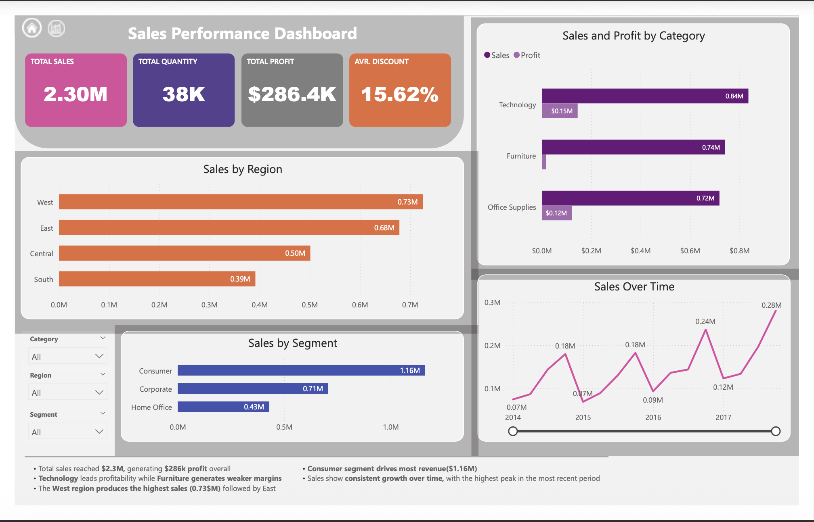
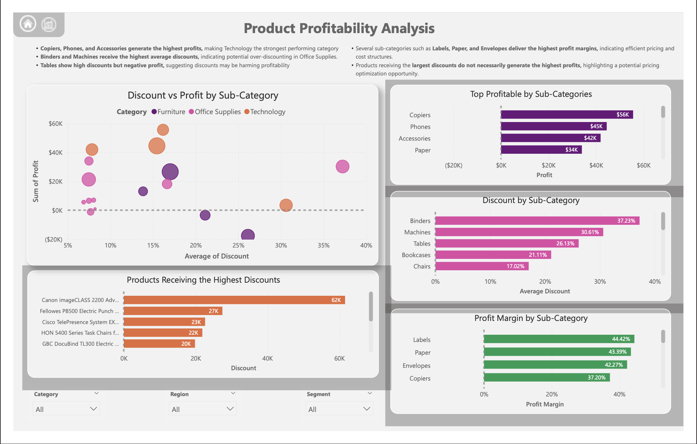

## Power BI Sales & Profitability Dashboard

This project analyzes sales performance and product profitability using the Superstore dataset.

## Objectives
- Evaluate overall sales performance
- Identify the most profitable product categories
- Analyze how discounts impact profitability
- Highlight high-margin products and potential pricing issues

## Tools Used
- Power BI
- Data Modeling
- DAX (Profit Margin calculation)

## Key Insights
- Technology products generate the highest profits.
- Binders and Machines receive the highest average discounts.
- Tables show high discounts but negative profitability.
- Labels, Paper, and Envelopes deliver the highest profit margins.

## Dashboard Overview

### Executive Sales Overview

### Product Profitability Analysis

